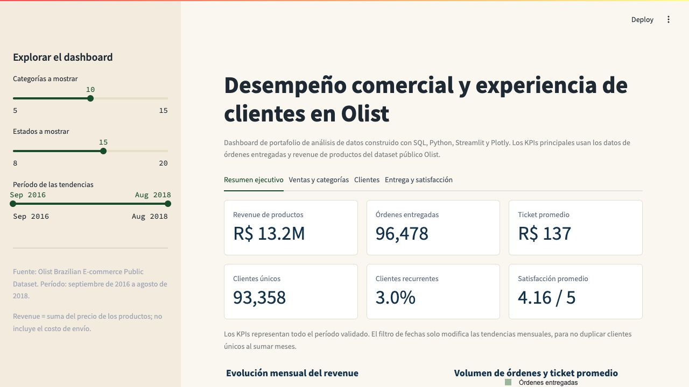
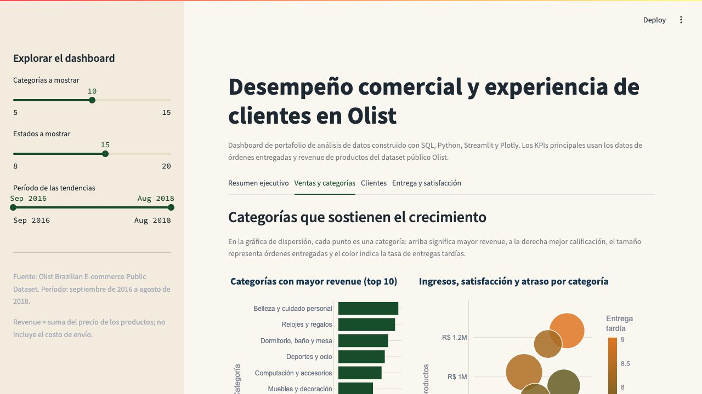
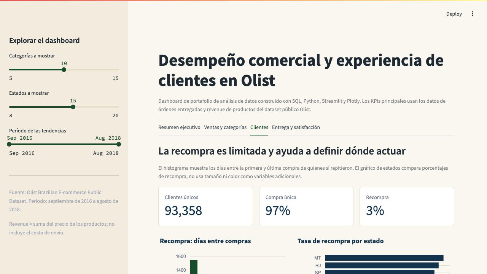
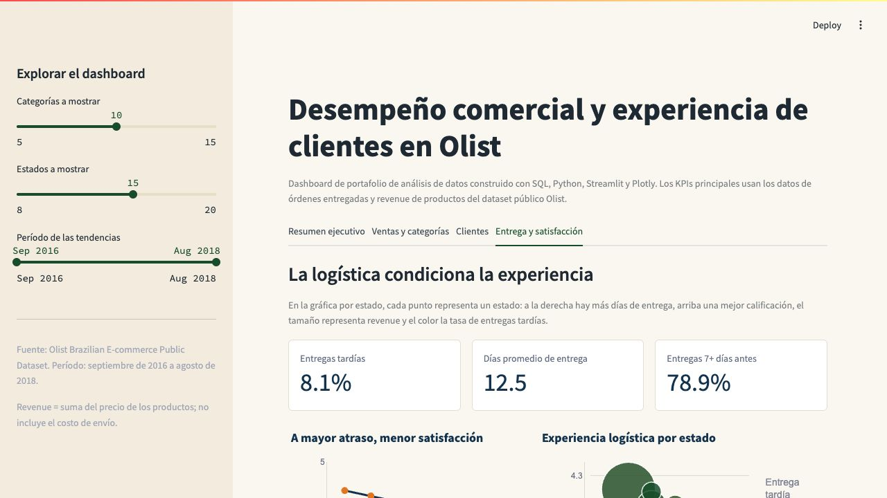

# Análisis de e-commerce: desempeño comercial y experiencia de clientes en Olist

Proyecto de portafolio de Data Analyst que transforma datos transaccionales de Olist en recomendaciones comerciales y operacionales reproducibles.

**Stack:** SQL · DuckDB · Python · pandas · Jupyter · Streamlit · Plotly

**Dashboard en línea:** [Abrir dashboard interactivo](https://olist-ecommerce-analytics-jb.streamlit.app)

**Datos fuente:** [Olist Brazilian E-Commerce Public Dataset en Kaggle](https://www.kaggle.com/datasets/olistbr/brazilian-ecommerce). Los CSV crudos no se incluyen en este repositorio.

**Pregunta de negocio:** ¿dónde debería enfocar Olist sus esfuerzos comerciales y operacionales para crecer, mejorar la recompra y proteger la satisfacción del cliente?



## Resumen ejecutivo

- **El negocio movió R$ 13.22M en ingresos de productos** a través de 96,478 órdenes entregadas, con un ticket promedio de R$ 137 durante el período analizado.
- **La recompra es la oportunidad comercial más clara:** solo 2,801 de 93,358 clientes únicos realizaron más de una compra, una tasa de recurrencia de 3.0%.
- **La entrega condiciona la satisfacción:** las órdenes con 8 o más días de atraso reciben 1.71 de 5 en promedio, frente a 4.31 para las entregadas al menos siete días antes de lo prometido.
- **El mix está concentrado:** las cinco categorías líderes aportan 39.8% de los ingresos de productos. Escalarlas requiere observar simultáneamente volumen, calificación y entrega tardía.

## KPIs del período

Período cubierto: 15 de septiembre de 2016 a 29 de agosto de 2018. Los KPIs comerciales consideran únicamente órdenes con estado `delivered`.

| Métrica | Resultado |
| --- | ---: |
| Ingresos de productos | R$ 13.22M |
| Órdenes entregadas | 96,478 |
| Ticket promedio | R$ 137 |
| Clientes únicos | 93,358 |
| Clientes recurrentes | 2,801 (3.0%) |
| Calificación promedio | 4.16 / 5 |
| Entregas tardías | 8.11% |
| Días promedio de entrega | 12.5 |

## Hallazgos que orientan la decisión

### 1. La recompra merece una estrategia de ciclo de vida

El 97.0% de los clientes realizó una sola compra. Entre quienes sí repitieron, la mediana entre la primera y la última compra fue de 35 días. Esto sugiere probar campañas de reactivación poco después de la primera experiencia, por ejemplo mediante un experimento controlado entre los 30 y 60 días posteriores a la compra.

### 2. Los atrasos severos tienen un costo visible en satisfacción

La satisfacción disminuye de forma consistente a medida que aumenta el atraso. Las órdenes entre 4 y 7 días tarde promedian 2.11 de 5, y las de 8 o más días tarde llegan a 1.71. La prioridad operacional no debería ser solo reducir el promedio de días de entrega: también debe prevenir los casos extremos que deterioran la experiencia.

### 3. Las categorías líderes deben crecer con controles de experiencia

Belleza y cuidado personal, Relojes y regalos, Dormitorio, baño y mesa, Deportes y ocio y Computación y accesorios concentran 39.8% de los ingresos. La categoría Dormitorio, baño y mesa tiene el mayor número de órdenes entre las líderes, pero una calificación promedio de 3.92, por debajo del promedio general de 4.16. Antes de invertir más en demanda, conviene revisar la experiencia de entrega y postventa de las categorías con alto volumen y menor satisfacción.

## Recomendaciones iniciales

1. **Diseñar una prueba de recompra:** activar una campaña de seguimiento entre 30 y 60 días después de la primera compra y medir su efecto contra un grupo de control.
2. **Gestionar los atrasos como riesgo de experiencia:** crear alertas para órdenes con riesgo de superar la fecha prometida y revisar cobertura, transportista y promesa de entrega en los estados más lentos.
3. **Priorizar inversión por categoría con una mirada doble:** usar ingresos y volumen para decidir dónde crecer, pero incluir calificación y tasa de entrega tardía como condiciones para escalar.

## Dashboard interactivo

La aplicación permite explorar los KPIs y los principales drivers en cuatro pestañas:

- Resumen ejecutivo: evolución mensual de ingresos, órdenes y ticket promedio.
- Ventas y categorías: ranking y relación entre ingresos, satisfacción y atraso.
- Clientes: recurrencia, tiempo entre compras y tasa de recompra por estado.
- Entrega y satisfacción: relación entre cumplimiento de la promesa, calificación y experiencia logística por estado.

### Capturas del dashboard

| Resumen ejecutivo | Ventas y categorías |
| --- | --- |
|  |  |

| Clientes | Entrega y satisfacción |
| --- | --- |
|  |  |

Para ejecutarla localmente:

```bash
python3 -m venv .venv
source .venv/bin/activate
python -m pip install -r requirements.txt
streamlit run app/streamlit_app.py
```

Para ejecutar además el notebook y regenerar los outputs SQL, instala el entorno de desarrollo:

```bash
python -m pip install -r requirements-dev.txt
```

## Enfoque analítico y decisiones de modelado

El análisis parte del [dataset público de Olist en Kaggle](https://www.kaggle.com/datasets/olistbr/brazilian-ecommerce). La lógica se diseñó para evitar duplicar ingresos al relacionar órdenes con ítems, pagos y reseñas.

- Los KPIs comerciales se calculan solo con órdenes entregadas.
- Los ingresos de productos corresponden a la suma de `order_items.price`; el costo de envío se mantiene separado.
- Ítems, pagos y reseñas se agregan al nivel de `order_id` antes de unirlos a la tabla de órdenes.
- La recurrencia se calcula con `customer_unique_id`, no con el identificador técnico de cada orden.
- El análisis de categorías se realiza a nivel de ítem, porque una orden puede incluir más de una categoría.

Esta lógica se puede revisar en las consultas de [SQL](sql/README.md), en el [notebook de análisis exploratorio](notebooks/01_eda_olist.ipynb) y en el código de la [aplicación Streamlit](app/streamlit_app.py).

## Estructura del repositorio

```text
app/              Dashboard interactivo en Streamlit y Plotly
sql/              Tablas base, validaciones y consultas de negocio con DuckDB
notebooks/        Análisis exploratorio reproducible en Python
docs/             Contexto del dataset y decisiones analíticas
data/processed/   Extractos agregados que alimentan el dashboard
outputs/figures/  Capturas para la documentación del proyecto
```

## Limitaciones y siguientes preguntas

- El dataset es histórico y observacional; muestra asociaciones, no prueba que una acción cause un resultado.
- Los ingresos no incluyen costo de envío, descuentos, costos operativos ni margen, por lo que no representan rentabilidad.
- Agosto de 2018 puede estar incompleto dentro del período disponible, por lo que no se usa como referencia de crecimiento mensual.
- Los productos se identifican por códigos y no por nombres comerciales. Por eso el análisis prioriza categorías sobre productos individuales.
- Una siguiente versión puede incorporar riesgo de vendedores, análisis de texto de reseñas en portugués y visualización geográfica.
